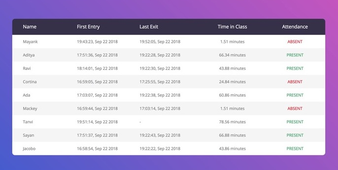

# ArKAL

ArKAL, short for Are Kids Attending Lectures?, is a facial recognition-based attendance monitoring system for classes and lectures built using OpenCV. The backend was built using a RESTful Flask server.

Given a photo roster for a class, we first model the face of each student using the `face_recognition` module. The intention is to run the script on a microcontroller with webcam attached near the door of a lecture hall so it tracks people as they enter and leave the class and can calculate the time they spent in the class. This data is sent to our backend where a student is marked absent or present depending on the percentage of time they were in lecture. The instructors can see the attendance for the lecture in the dashboard.

This project was created for [HackCMU 2018](http://hackcmu.org/), one Carnegie Mellon University's largest hackathons, along with team members [Aditya Pillai](mailto:apillai@andrew.cmu.edu) and [Pallavi Bhave](mailto:pbhave@andrew.cmu.edu).
